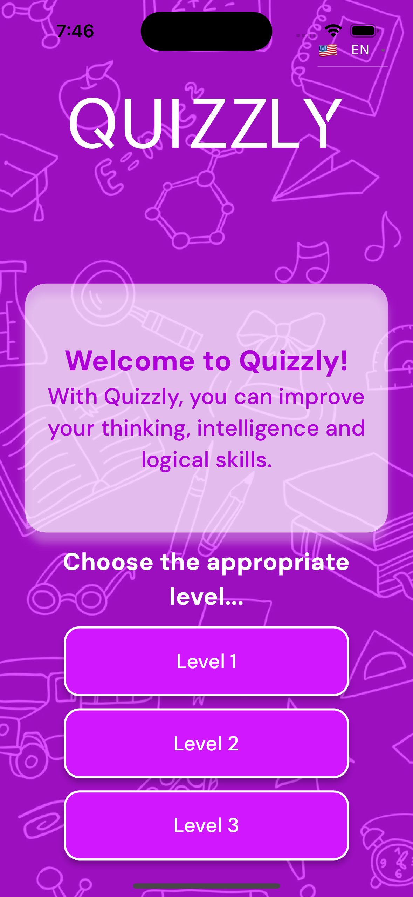
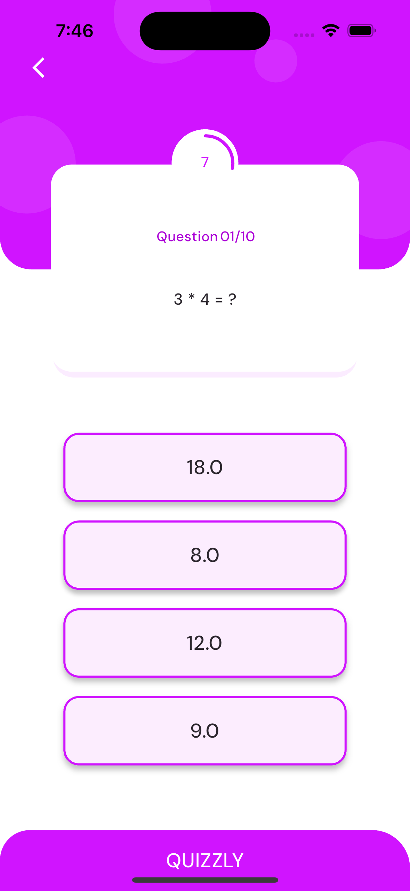
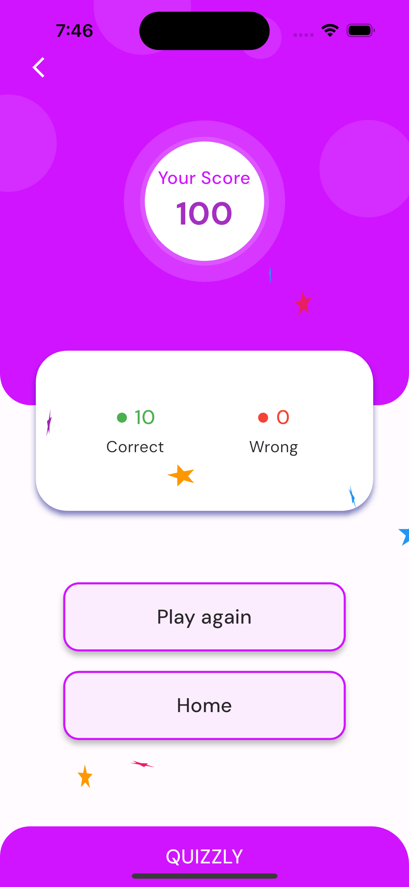

# Quizzly App

Introduction:
Welcome to Quizzly, your passport to a world of mathematical mastery! We present an innovative mobile application designed to make learning arithmetic operations a breeze, available in three languages: Uzbek, Russian, and English. Quizzly is not just a learning app; it's your personal math coach, motivating you to embrace and excel in the world of numbers.

## Features:
1. Diverse Test Exercises:
Quizzly boasts a vast collection of test exercises covering various arithmetic operations. Whether you're a beginner or a math enthusiast looking for a challenge, our app caters to all skill levels. Choose your preferred difficulty level and dive into a world of engaging math problems.

2. Multilingual Support:
Breaking language barriers, Quizzly offers a unique advantage by providing content in Uzbek, Russian, and English. Now, you can enhance your math skills in the language that suits you best, making learning not just effective but also enjoyable.

3. Customized Learning:
Tailor your learning experience with Quizzly's customizable settings. Select the difficulty level that matches your current skill set, ensuring a gradual and comfortable progression. Quizzly adapts to your pace, turning each session into a personalized learning journey.

4. Motivational Boost:
Learning math can be challenging, but Quizzly transforms the journey into an exciting adventure. Gain extra motivation to love and conquer math through our interactive features and engaging challenges. Quizzly isn't just an app; it's your partner in building a strong foundation in mathematics.

## Getting Started

- The program is under development. 

Follow us on [github.com](https://github.com/SultanbaevS) to stay
up to date with more exciting applications!

